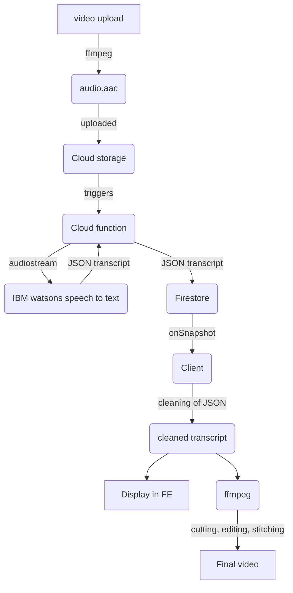

```mermaid
graph TD
A[video upload] -->|ffmpeg|B(audio.aac)
B -->|uploaded| C(Cloud storage)
C -->|triggers| D(Cloud function)
D -->|audiostream| E(IBM watsons speech to text)
E -->|JSON transcript| D
D -->|JSON transcript| F(Firestore)
F -->|onSnapshot| G(Client)
G -->|cleaning of JSON| H(cleaned transcript)
H --> J[Display in FE]
H --> K(ffmpeg)
K -->|cutting, editing, stitching| L[Final video]
```
